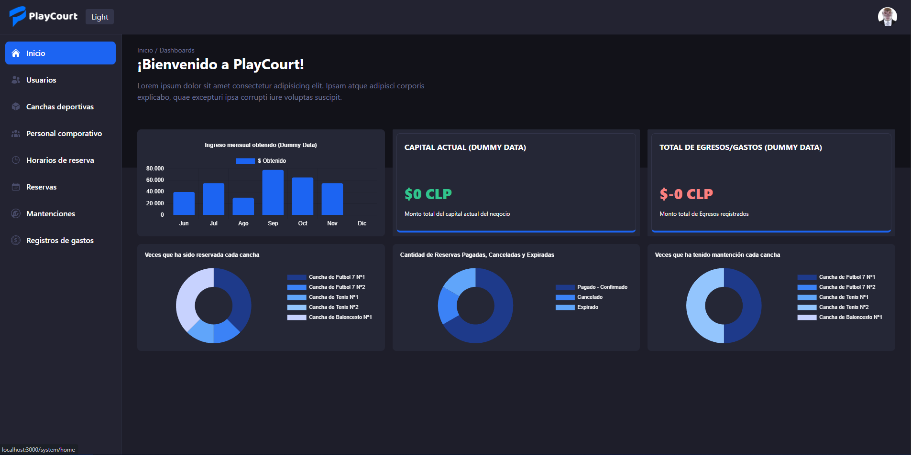
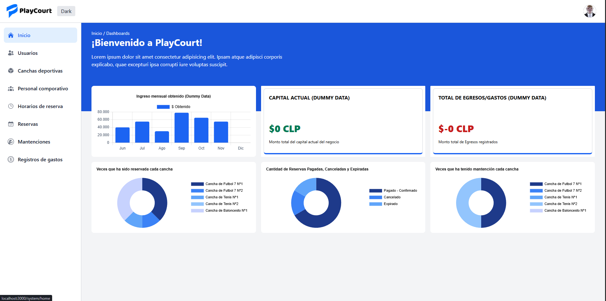
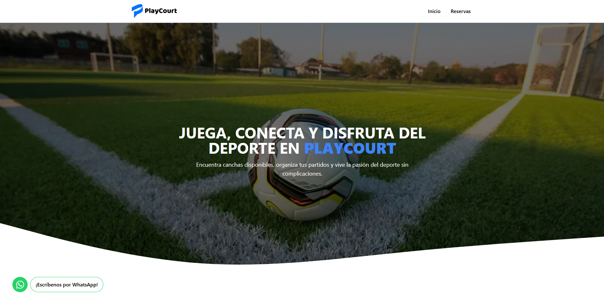
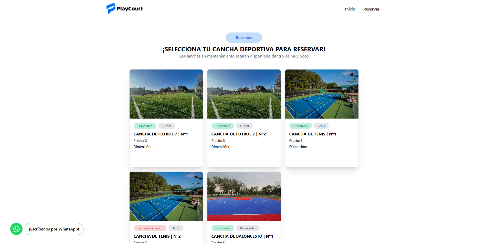

<h3 align="center">PlayCourt Project</h3>

---

# Introducción

PlayCourt es un proyecto realizado en el ramo de "Proyecto de Integración" enfocado en la gestión de reservas para canchas deportivas, simulando posibles datos reales como nombre, dimensión, categoría, etc. (Proyecto actualmente pausado)

